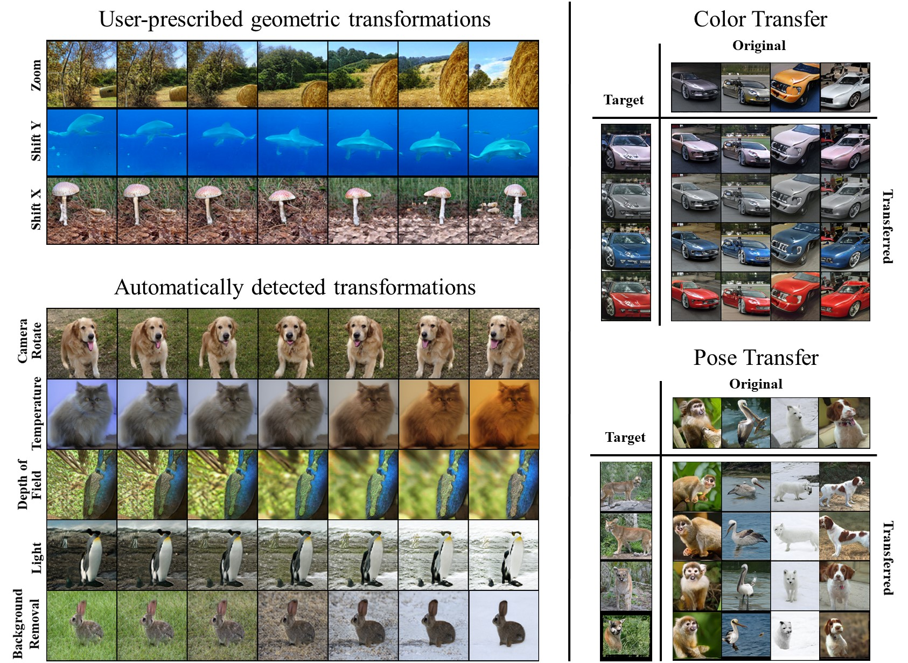

# An official pytorch implementaiton of [GAN "Steerability" without optimization](https://arxiv.org/pdf/2012.05328.pdf) 

Generally, our methods are coded in the file BigGAN.py. Each path can be extracted by directing the "method" flag accordingly.
For easier reproducing, you can use main.py.

## USER-SPECIFIED GEOMETRIC TRANSFORMATIONS

Path | Flag
------------ | -------------
Linear  | 'l_shifty', 'l_zoom' and 'l_shiftx'
Newmann  |  'nl_shifty', 'nl_zoom' and 'nl_shiftx'
Great circle | 'gcircle_shifty', 'gcircle_zoom' and 'gcircle_shiftx'

## UNSUPERVISED EXPLORATION OF TRANSFORMATIONS
The principal latent space directios are based on the right singular vectors of the SVD on the FC weight matrix.  Here the flags for the first layer unsupervised paths i.e., all principal latent space directions extracted from the first weight matrix:

Path | Flag
------------ | -------------
Linear  | 'svd_linear'
Great circle | 'svd_gcircle'
Small circle | 'svd_scircle'

And here the corresponding paths of other scales:

Path | Flag
------------ | -------------
Linear  | 'linearin'
Great circle | 'greatin'
Small circle | 'smallin'

For your conveneint we are also sharing multiple functions for extracting directions and for walks. 

## Running examples

